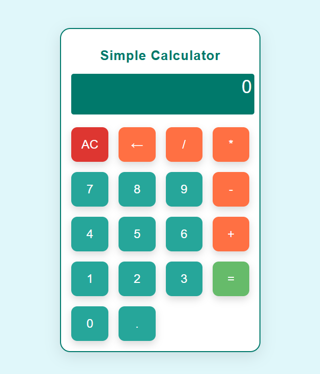

🔢 Simple Calculator (Vanilla JS)

A simple, fully functional **Calculator** built using **Vanilla JavaScript**, **HTML**, and **CSS**. 
This app allows basic arithmetic calculations and is designed with a minimalistic and user-friendly interface.

🚀 Live Demo
👉 https://vanillajsiad.netlify.app/ 

✅ Features
- Basic arithmetic operations: Addition, Subtraction, Multiplication, Division
- Clear (`AC`) and backspace (`←`) functionality
- Real-time input and display updates
- Error handling for invalid inputs
- Responsive and mobile-friendly layout
- All functionality handled using plain JavaScript (no frameworks)

 📌 How to Use
1. **Open the App**  
   Visit the Live Demo in your browser.

2. **Enter Numbers**  
   Click the number buttons (0-9) to enter digits.

3. **Perform Operations**  
   Click the operator buttons (`+`, `-`, `*`, `/`) to perform calculations.

4. **Clear the Display**  
   Click the `AC` button to reset the calculator.

5. **Backspace**  
   Use the `←` button to remove the last entered digit.

6. **Calculate**  
   Press the `=` button to get the result.

🧪 Tech Stack
- HTML5
- CSS3
- JavaScript (Vanilla)

📸 Screenshot

 

---

